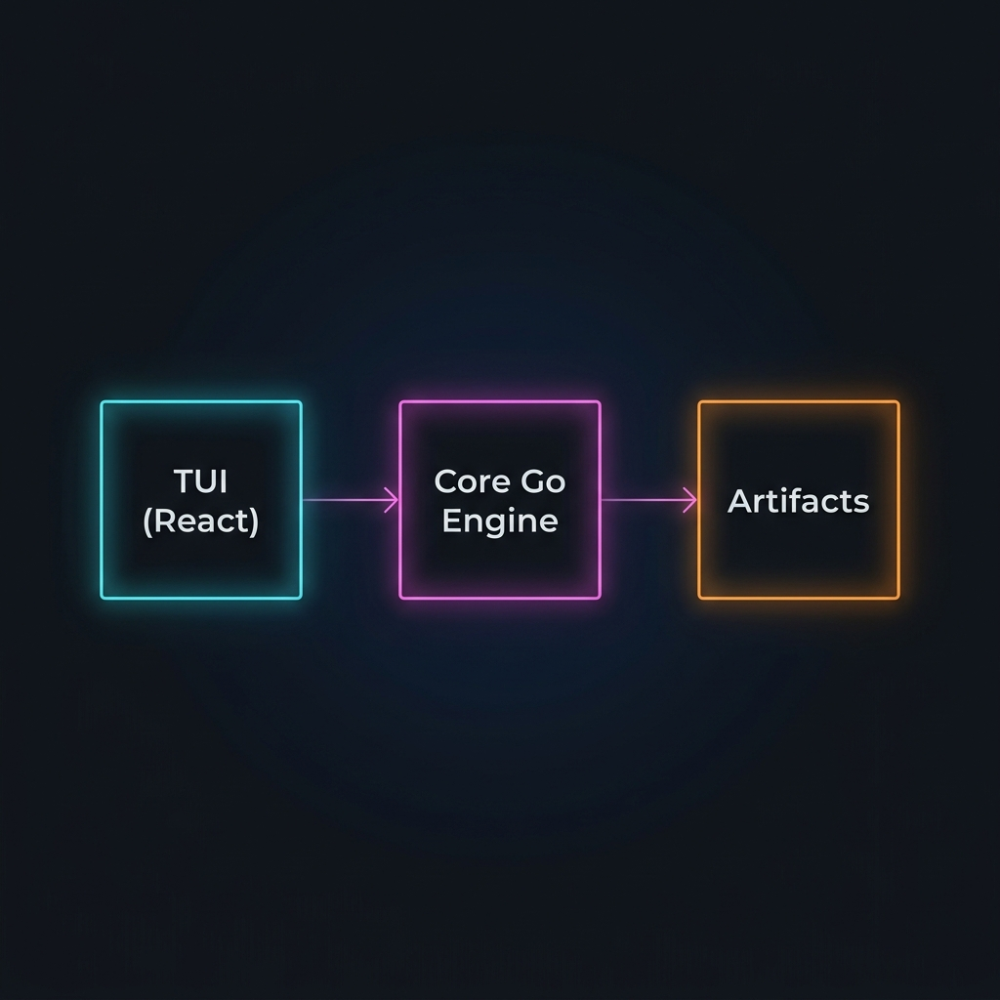

# Go Code

An agentic coding CLI powered by LLMs. Think, plan, and execute code changes from your terminal.

## Architecture & Vision

`Go Code` is built on three core pillars:

1.  **TUI (React/Ink):** A highly interactive terminal UI that provides real-time feedback, grouped tool execution transcripts, and dynamic progress indicators.
2.  **Go Engine:** A high-performance backend that handles the agent loop, tool execution (bash, file system, git, search), and project-level orchestration with built-in permission gating.
3.  **Artifacts:** A structured way to view and manage complex outputs like implementation plans, walkthroughs, and technical feedback in a dedicated panel.



## Install

### macOS / Linux (one command)

```bash
curl -fsSL https://raw.githubusercontent.com/channyeintun/gocode/main/gocode/install.sh | sh
```

This requires published GitHub release assets for your platform. The installer prefers direct platform binaries and falls back to the older `.tar.gz` archive format for older releases.

The installer chooses a writable install directory automatically:

- `/usr/local/bin` if it is writable
- `~/.local/bin` otherwise

It installs two binaries: `gocode` and `gocode-engine`.

No runtime dependencies — no Node.js, no Go, nothing else needed.

After install, verify:

```bash
command -v gocode
```

If your shell still cannot find it, add the install directory to your PATH. For example:

```bash
export PATH="$HOME/.local/bin:$PATH"
```

### Manual install

Download the two binaries for your platform from [Releases](https://github.com/channyeintun/gocode/releases):

| Platform            | `gocode` asset         | `gocode-engine` asset         |
|---------------------|------------------------|-------------------------------|
| macOS Apple Silicon | `gocode-darwin-arm64`  | `gocode-engine-darwin-arm64`  |
| macOS Intel         | `gocode-darwin-amd64`  | `gocode-engine-darwin-amd64`  |
| Linux x86_64        | `gocode-linux-amd64`   | `gocode-engine-linux-amd64`   |
| Linux ARM64         | `gocode-linux-arm64`   | `gocode-engine-linux-arm64`   |

Download and copy both files to a directory in your `PATH`:

```bash
curl -fsSL -o gocode https://github.com/channyeintun/gocode/releases/latest/download/gocode-darwin-arm64
curl -fsSL -o gocode-engine https://github.com/channyeintun/gocode/releases/latest/download/gocode-engine-darwin-arm64
sudo install -m 755 gocode /usr/local/bin/gocode
sudo install -m 755 gocode-engine /usr/local/bin/gocode-engine
```

`install -m 755` is used instead of `cp` so the binary is copied and marked executable in one step.

Older releases may only include `gocode-<platform>.tar.gz`. The installer still supports that layout as a fallback.

If you do not want to use `sudo`, install to a user-owned directory instead:

```bash
mkdir -p "$HOME/.local/bin"
install -m 755 gocode "$HOME/.local/bin/gocode"
install -m 755 gocode-engine "$HOME/.local/bin/gocode-engine"
```

Then make sure `~/.local/bin` is on your PATH:

```bash
export PATH="$HOME/.local/bin:$PATH"
```

If you are working from a local clone and want to install the current build directly, use the built release directory:

```bash
cd gocode/tui
make release-local
mkdir -p "$HOME/.local/bin"
install -m 755 release/gocode "$HOME/.local/bin/gocode"
install -m 755 release/gocode-engine "$HOME/.local/bin/gocode-engine"
export PATH="$HOME/.local/bin:$PATH"
```

## Setup

Set your API key:

```bash
export ANTHROPIC_API_KEY="sk-ant-..."
```

Supported providers and their environment variables:

| Provider   | Env Variable         |
|------------|----------------------|
| Anthropic  | `ANTHROPIC_API_KEY`  |
| OpenAI     | `OPENAI_API_KEY`     |
| Google     | `GEMINI_API_KEY`     |
| DeepSeek   | `DEEPSEEK_API_KEY`   |
| Groq       | `GROQ_API_KEY`       |
| Mistral    | `MISTRAL_API_KEY`    |
| Ollama     | (none — runs locally)|

## Usage

```bash
gocode
```

That's it. You'll see a terminal UI with a prompt. Type your request and press Enter.

### Options

```
gocode --model openai/gpt-4o        # Use a different model
gocode --model ollama/gemma3         # Use a local model via Ollama
gocode --mode fast                   # Skip planning, execute directly
gocode --help                        # Show help
```

### Slash Commands

| Command       | Description                             |
|---------------|-----------------------------------------|
| `/plan`       | Switch to plan mode (think before writing) |
| `/fast`       | Switch to fast mode (execute directly)  |
| `/model <m>`  | Change model (e.g. `/model openai/gpt-4o`) |
| `/cost`       | Show token usage and cost               |
| `/compact`    | Compress conversation to free up context |
| `/resume`     | Resume a previous session               |

### Permission System

When the agent wants to run a command or write a file, you'll see a permission prompt:

```
╭─ Permission Required ──────────────────────╮
│ bash: git status                            │
│ Risk: execute                               │
│                                             │
│ [y] Allow  [n] Deny  [a] Always Allow       │
│ [s] Allow All (This Session)                │
╰─────────────────────────────────────────────╯
```

| Key | Action |
|-----|--------|
| `y` | Allow this one command |
| `n` | Deny this command |
| `a` | Always allow this exact command |
| `s` | Allow all non-destructive commands for this session |

Destructive commands (`rm -rf`, `git push --force`, `DROP TABLE`, etc.) always require explicit approval, even with `[s]`.

Background shell sessions are also supported through the `bash` tool by setting `background=true`, then following up with `command_status` and `send_command_input` using the returned `CommandId`.

## Tools

The agent has access to:

| Tool | Description |
|------|-------------|
| **bash** | Execute shell commands |
| **file_read** | Read file contents |
| **file_write** | Create or overwrite files |
| **file_edit** | Find-and-replace edits in files |
| **glob** | Find files by pattern |
| **grep** | Search file contents (ripgrep) |
| **web_search** | Search the web |
| **web_fetch** | Fetch and read a URL |
| **git** | Read-only git operations (status, diff, log, blame) |

## Configuration

Config file: `~/.config/gocode/config.json`

```json
{
  "model": "anthropic/claude-sonnet-4-20250514",
  "default_mode": "plan"
}
```

Environment variables override the config file:

| Variable | Description |
|----------|-------------|
| `GOCODE_MODEL` | Model to use |
| `GOCODE_API_KEY` | API key (overrides provider-specific keys) |
| `GOCODE_BASE_URL` | Custom API base URL |
| `GOCODE_PERMISSION_MODE` | `default`, `autoApprove`, or `bypassPermissions` |
| `USE_LOCAL_MODEL` | Opt in to using Ollama for internal helper tasks like compaction |

`USE_LOCAL_MODEL` does not change the main chat model. It only enables local routing for internal helper tasks that are already wired for it. Right now that means compaction.

## Architecture

```
┌──────────────────────────────┐
│  gocode (Bun standalone)     │  ← Terminal UI (React Ink)
│    Renders TUI, handles I/O  │
│         │ stdin/stdout NDJSON │
│  ┌──────▼────────────────┐   │
│  │ gocode-engine (Go)     │   │  ← LLM client, tools, agent loop
│  │  Streams events out    │   │
│  │  Reads commands in     │   │
│  └────────────────────────┘   │
└──────────────────────────────┘
```

Both binaries must be in the same directory (or `gocode-engine` must be in `PATH`).

## Building from Source

Requires: Go 1.26+, Node.js 20+, Bun 1.0+

```bash
cd gocode/tui
npm run setup          # Install deps, build TS, compile Go engine
npm start              # Run via Node.js (development)

make release-local     # Build standalone binaries for your platform
make release           # Cross-compile for all platforms
make install           # Install to /usr/local/bin
```

## License

See [LICENSE](LICENSE).
